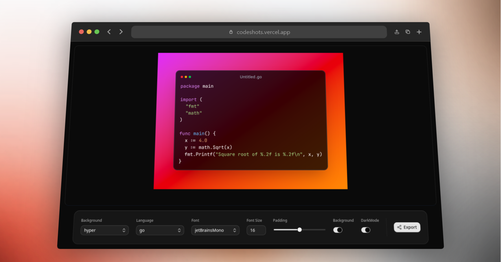

# Codeshots

> Turn your code into beautiful screenshots — instantly.

**[Live Demo →](https://codeshots.vercel.app)**

---

## Features

- 10+ gradient backgrounds · light & dark mode
- 12+ monospace fonts · adjustable font size & padding
- Auto language detection & syntax highlighting
- Export as PNG or SVG · copy image to clipboard
- Resizable canvas · custom file name with language extension

---

## Stack

[Next.js](https://nextjs.org) · [React](https://react.dev) · [TypeScript](https://www.typescriptlang.org) · [Tailwind CSS](https://tailwindcss.com) · [Zustand](https://github.com/pmndrs/zustand) · [Highlight.js](https://highlightjs.org) · [html-to-image](https://github.com/bubkoo/html-to-image)
